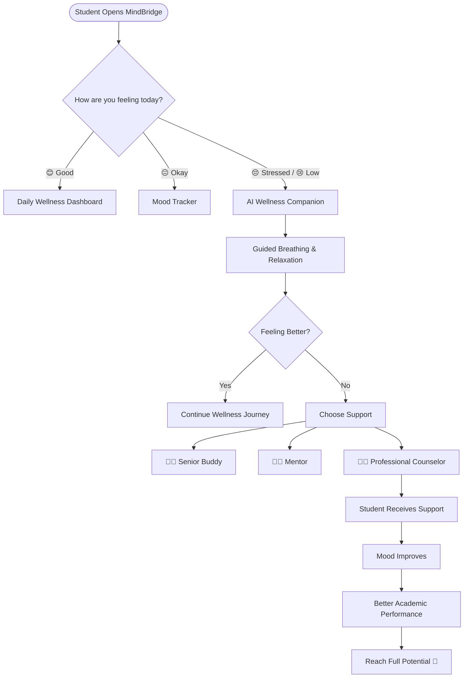

"Every year, thousands of talented students struggle—not because they lack ability, but because they lack support. MindBridge exists to ensure that mental health never becomes a barrier to a student's potential."
# 🌿 MindBridge – A Digital Mental Wellness Platform for University Students

# ❤️ Our Story

MindBridge was inspired by the real challenges that many first-year university students experience.

The transition from school to college is exciting, but it can also be overwhelming. Homesickness, academic pressure, loneliness, anxiety, and the lack of proper guidance often make students struggle silently. These challenges can affect confidence, learning, and academic performance, even for highly capable and hardworking students.

We believe that **no student's potential should be limited by a lack of mental health support or guidance.**

Our mission is to ensure that every first-year student has access to the right support at the right time—whether through self-help resources, peer mentors, senior buddies, or professional counselors.

> **"Talent should define a student's future—not stress, loneliness, or the absence of support."**

---

# 🎯 Our Motto

**"Supporting Minds. Unlocking Potential."**

### Our Vision

To build a campus where every student feels heard, supported, and empowered to reach their true potential without mental health becoming a barrier to success.

### Our Mission

- Reduce the stigma around mental health.
- Provide immediate access to trusted support.
- Connect students with senior buddies, mentors, and professional counselors.
- Encourage healthy daily habits through wellness tools.
- Help students thrive academically and emotionally.

---

## 📖 Overview

**MindBridge** is a student-first digital mental wellness platform designed to support first-year university students as they transition into college life.

Many students experience homesickness, stress, anxiety, loneliness, academic pressure, and a lack of guidance during their first semester. MindBridge aims to bridge this gap by combining technology, peer support, and access to professional resources in a safe, accessible, and engaging platform.

> **Our Vision:** *No student should feel alone during their university journey.*

---

## 🎯 Problem Statement

Research shows that a significant number of first-year students experience mental health challenges due to:

- Academic pressure
- Homesickness
- Social isolation
- Difficulty adjusting to university life
- Lack of awareness of available support
- Fear of asking for help because of stigma

These challenges can negatively affect academic performance, confidence, and overall well-being.

---

## 💡 Our Solution

MindBridge provides a supportive digital ecosystem where students can:

- Track their daily mood
- Learn evidence-based stress management techniques
- Practice guided breathing and relaxation exercises
- Access campus mental health resources
- Connect with trained senior buddies and mentors
- Discover verified professional counselors
- Join wellness workshops and awareness campaigns
- Build healthy habits through gamified wellness challenges

The platform is designed to encourage early support, reduce stigma, and help students find the right resources when they need them.

---
### 🌟 What Makes MindBridge Different?

Unlike traditional mental health apps, MindBridge combines AI-powered wellness guidance with real human support through senior buddies, mentors, and verified professional counselors. Our goal is not just to provide information, but to ensure that every student can find the right support at the right time.

## ✨ Key Features

### 😊 Mood Tracker
- Daily emotional check-ins
- Mood history
- Weekly and monthly insights

### 🌬️ Guided Breathing Exercises
- Box Breathing (4-4-4-4)
- 4-7-8 Breathing
- Deep Calm Breathing
- Animated breathing bubble
- Nature sounds and relaxation timer

### 🤖 AI Wellness Companion
- Educational wellness guidance
- Stress management tips
- Study and productivity suggestions
- Campus resource recommendations

> **Disclaimer:** The AI assistant does not diagnose medical conditions or replace professional mental health care.

### 👩‍🎓 Senior Buddy Connect
- College guidance
- Academic support
- Campus navigation
- Friendly conversations

### 👨‍🏫 Mentor Support
- Time management
- Career planning
- Study strategies
- Personal development

### 🧑‍⚕️ Professional Counselor Directory
- Verified counselors
- Contact information
- Appointment guidance
- Online and offline support resources

### 🗺️ Campus Resource Hub
- Counseling center
- Faculty mentors
- Student support clubs
- Emergency contacts
- Trusted online mental health resources

### 📝 Private Journal
- Daily reflections
- Gratitude entries
- Personal wellness notes

### 🌱 Wellness Challenges
- Daily self-care goals
- Habit streaks
- Achievement badges
- Progress tracking

### 📅 Workshops & Events
- Registration
- Event details
- Attendance tracking
- Feedback collection

---

# 🔄 MindBridge User Flow

## 🔄 MindBridge User Flow

---
## 🏗️ System Architecture

> Architecture diagram coming soon.

## 🛠️ Tech Stack

### Frontend
- React
- TypeScript
- Tailwind CSS
- Framer Motion

### Backend
- Firebase Authentication
- Cloud Firestore
- Firebase Storage

### Charts
- Chart.js

### Hosting
- Firebase Hosting

---

## 🎯 Target Users

- First-year undergraduate students
- Student mentors
- Faculty advisors
- University counseling centers

---

## 🚀 Future Scope

- AI-powered personalized wellness recommendations
- Multilingual support
- Mobile application
- Anonymous peer support community
- University admin dashboard
- Smart analytics for awareness campaigns
- Integration with campus wellness initiatives

---

## 🌱 Impact We Want to Create

We don't just want students to manage stress.

We want every first-year student to know that asking for help is a sign of strength, not weakness.

Our goal is to create a supportive campus ecosystem where students can confidently seek guidance, build meaningful connections, and focus on learning without feeling alone.

**Because every deserving student deserves the opportunity to succeed—not just academically, but emotionally as well.**

---

## ⚠️ Important Disclaimer

MindBridge is an educational and wellness support platform. It is **not** a medical device or a replacement for professional mental health care.

If a user is experiencing a mental health crisis or believes they may be at risk of harming themselves or others, they should immediately contact local emergency services or a qualified mental health professional.

## 📄 License

This project is licensed under the MIT License. See the [LICENSE](LICENSE) file for more details.

---

## 👩‍💻 Author

**Neha Gupta**

Computer Science Engineering Student

Chandigarh University

GitHub: https://github.com/neha-gupta887

LinkedIn: https://linkedin.com/in/neha-gupta-82201a360
